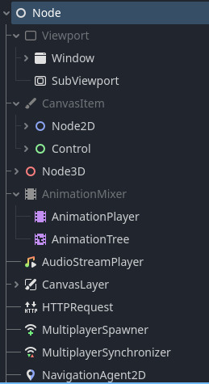

# Creare videogames con

---
layout: intro
class: text-center
hideInToc: true
--- 

# Speaker

 { style="border-radius: 50%; display: inline; width: 150px;" }

### Andrea Peretti

Gameplay Programmer @ Ubisoft Milan

[www.andxet.dev](https://www.andxet.dev)

---
layout: statement
---

## Game Engines

> Un game engine è un framework creato principalmente per lo sviluppo di videogames, e solitamente include librerie e programmi di supporto come un editor di livelli.

-- Wikipedia

---

## Game Engines

I game engines più famosi mettono a disposizione dello sviluppatore:

- Rendering Engine (2D e/o 3D)
- Physics engine e collision detection
- Audio engine
- Animation engine
- Scripting
- Networking
- Gestione asset (immagini, mesh, clip audio...)
- Editor di livelli
- ...

---
layout: center
class: text-center
---

## Godot Game Engine

{ width=200px; style="display: inline;" }

[https://godotengine.org/](https://godotengine.org/)

---

## Storia di Godot

Lo sviluppo è iniziato nel 2001 dagli sviluppatori  **Linietsky** e **Verschelde** in **Codenix**, azienda di consulenza di game development in Argentina, con il nome di **Larvotor**.

Nel corso dei successivi 10 anni l'engine ha cambiato nome più volte, fino a chiamarsi, appunto, **Godot**. 

---

## Storia di Godot

Il nome si ispira all'opera teatrale **Aspettando Godot** di *Samuel Beckett*, poiché rappresenta il desiderio incessante di aggiungere nuove funzionalità all'engine, che lo avvicinerebbero a un prodotto esaustivo, ma non lo farà mai (perchè ci sarà sempre qualcosa che può essere migliorato).

---

## Storia di Godot

Il rilascio dell'engine in versione open source avvenne nel **2014** sotto licenza **MIT**.

Ricevette finanziamenti da Mozilla e Microsoft, venne effettuato un refactoring del codice e venne aggiunto C# ai linguaggi supportati.

Gli sviluppatori, **Linietsky** e **Verschelde** iniziarono a lavorare full time all'implementazione. Venne rilasciata la versione 3.0

---

## Storia di Godot

Nel 2019 si iniziò a lavorare alla versione 4.0 che comportò un grande refactoring, venne poi rilasciata nel 2023.

Nel settembre 2023, complice una generale insoddisfazione per alcune modifiche ai costi di licenza di **Unity Engine**, Godot ricevette una grande attenzione dagli sviluppatori ed una donazione di 100.000$ da Re-Logic.

---

## Caratteristiche

Godot supporta la creazione di eseguibili per:

- Windows
- macOS
- Linux, *BSD
- Android
- iOS
- Web

---

## Caratteristiche

- Game engine general purpose
- Utilizza un albero di nodi per definire scene
- Parti di questo albero possono essere loro volta delle scene (file .tscn che possono essere riutilizzati)
- Ogni nodo può avere uno script (gdscript, C#)
- I nodi possono emettere segnali, che possono essere collegati a callback (osservator pattern)

---

## La documentazione

[https://docs.godotengine.org/en/stable/](https://docs.godotengine.org/en/stable/)

Ottima per imparare non solo come funziona l'engine, ma il gamedev in generale!

---

## Editor

 { width=600px; }

---
layout: two-cols-with-title
---

## Nodi

::left::


::right::

- L'albero dei nodi di Godot permette di creare **gerarchie di oggetti**
- Parti dell'albero possono essere **salvati come scene in modo da essere riutilizzati** (ad esempio per nemici, oggetti di gioco, ecc...)
- Ogni nodo può avere associato uno **script**, uno o più **gruppi**, essere **nascosto**
- I nodi figli di un nodo sono relativi al loro padre: se il padre è nascosto, lo saranno anche loro. La transform dei nodi figli sono locali a quella del padre

---
layout: two-cols-with-title
---

## Nodi

::left::



::right::

- Tutti i nodi estendono la classe `Node`
- `Node2D` è il tipo base per i giochi 2D, allo stesso modo `Node3D` è il tipo base per i giochi 3D
- `Control`è il tipo base per gli elementi della *UI*

---

## Scripting

Godot supporta ufficialmente:

- GDScript
- C#
- (C, C++)

---
layout: two-cols-with-title
---

## GDScript

::left::

```python
# Everything after "#" is a comment.
# A file is a class!

# (optional) icon to show in the editor dialogs:
@icon("res://path/to/optional/icon.svg")

# (optional) class definition:
class_name MyClass

# Inheritance:
extends BaseClass


# Member variables.
var a = 5
var s = "Hello"
var arr = [1, 2, 3]
var dict = {"key": "value", 2: 3}
var other_dict = {key = "value", other_key = 2}
var typed_var: int
var inferred_type := "String"

```

::right::

- Imperativo
- Orientato agli oggetti
- Gradually typed
- Creato appositamente per Godot
- **Non è Python!** Ma utilizza una sintassi ad indentazione simile.
- Non usa un **garbage collector** ma un sistema di **reference counting**

---
layout: two-cols-with-title
---

## GDScript

::left::

```python
# Functions.
func some_function(param1, param2, param3):
	const local_const = 5

	if param1 < local_const:
		print(param1)
	elif param2 > 5:
		print(param2)
	else:
		print("Fail!")

	for i in range(20):
		print(i)

	while param2 != 0:
		param2 -= 1

	match param3:
		3:
			print("param3 is 3!")
		_:
			print("param3 is not 3!")

	var local_var = param1 + 3
	return local_var

```

::right::

```python
# Constants.
const ANSWER = 42
const THE_NAME = "Charly"

# Enums.
enum {UNIT_NEUTRAL, UNIT_ENEMY, UNIT_ALLY}
enum Named {THING_1, THING_2, ANOTHER_THING = -1}

# Built-in vector types.
var v2 = Vector2(1, 2)
var v3 = Vector3(1, 2, 3)

# Functions override functions with the same name on the
# base/super class.
# If you still want to call them, use "super":
func something(p1, p2):
	super(p1, p2)

# Constructor
func _init():
	print("Constructed!")
	var lv = Something.new()
	print(lv.a)
```

---

## Gradually typed

La *tipizzazione graduale* è un type system in cui ad alcune variabili ed espressioni possono essere assegnati tipi e la correttezza della digitazione viene verificata in **fase di compilazione** (che è *tipizzazione statica*) e alcune espressioni possono essere lasciate non tipizzate e eventuali errori di tipo vengono segnalati in **fase di esecuzione** (che è la *digitazione dinamica*).

<div grid="~ cols-2 gap-4">
<div>

```python
func sum(a, b):
    return a + b

var res = sum(22, 20)
```

</div>
<div>

```python
func sum(a: int, b: int) -> int:
    return a + b

var res: int = sum(22, 20)
```

</div>
</div>

Sono entrambi validi!

---

## Overridable functions

L'engine permette di effettuare l'override di alcune funzioni per permettere ai nostri script di gestire la logica di gioco (pattern **IoC**, *Inversion of Control*):

```python
# Called when both the node and its children have entered the scene tree.
func _ready():
	pass

# Called every frame.
func _process(delta):
	pass

# Called every physics frame.
func _physics_process(delta):
	pass

# Called once for every event before _unhandled_input(), allowing you to
# consume some events.
func _input(event):
	pass

# Called once for every event.
func _unhandled_input(event):
	pass
```

---

## Annotazioni

### @export


<div grid="~ cols-2 gap-4">
<div>

```python
@export var string = "Hello"
@export var int_number = 5
@export var int_number_2: int
@export var log_label: Label
@export var camera: Camera3D
```

</div>
<div>


</div>
</div>

Utile per vedere parametri dello script nell'inspector (simile ai *campi pubblici* di Unity o le *UPROPERTY* di Unreal)

---

## Annotazioni

### @onready

```python
@onready var interact_label: Label = $"Control/Interaction label"
@onready var head: Node3D = $Head

# Equivalente a:
var head: Node3D

func _ready():
    head = $Head

# Valutare come alternativa:
@export var head: Node3D # Settare da inspector
```

Utile per ottenere un riferimento ad un nodo della scena (Attenzione!! Se si usa lo script in una scena con una composizione diversa, potrebbe non funzionare più!)

---

## Consiglio

Possiamo generare le righe @onready con il drag&drop: rilasciando verrà inserito il path:

```python
$Control/Interaction_label
```

Se premiamo `Ctrl` al rilascio verrà aggiunta anche la dichiarazione della variabile:

```python
@onready var interact_label: Label = $Control/Interaction_label
```

---
layout: two-cols-with-title
---

## Segnali

Permettono di disaccoppiare il codice applicando il **pattern observer**. Una serie di oggetti si registrano ad un segnale e vengono avvisati quando viene generato un evento.

::left::

```python
signal damaged(damage_amount: int, current_health: int)

func damage(amount: int) -> void:
	current_health -= amount
	damaged.emit(amount, current_health)
```

::right::


---

## Segnali

Possiamo "collegare" un segnale dal pannello Signals. Dovremo scegliere uno script in cui generare la callback:

```python
# When receiving a damage, rotate the camera on Z axis to give a visual feedback
func _on_damage_area_damaged(_damage_amount, _current_health):
	var hit_tween = get_tree().create_tween()
	hit_tween.tween_property(camera, "rotation:z", deg_to_rad(10), 0.1)
	hit_tween.tween_property(camera, "rotation:z", deg_to_rad(0), 0.1)
	await hit_tween.finished
```

---

# Coroutine

Tramite la keyword await possiamo bloccare l'esecuzione di una funzione ed aspettare un evento:

```python
await get_tree().create_timer(5).timeout # Aspetta 5 secondi
await idol.on_picked_up                  # Aspetta il segnale on_picked_up
await fade_out_anim()                    # Aspetta la fine di una funzione
```

Se una funzione possiede la keyword `await` è una coroutine.

```python
await fade_out_anim()                    # Aspetta la fine della una funzione
print("Hello!")                          # Stampa dopo la funzione

# oppure

fade_out_anim()                          # Lancia la funzione e se ne dimentica
print("Hello!")                          # Viene stampato immediatamente
```

---

# San Martino's quest

La demo creata per questa presentazione è stata creata con Godot 4.2.1, ed utilizza un modello creato tramite fotogrammetria della Pieve San Martino a Gattico-Veruno (NO).

Lo scopo del gioco è recuperare l'**idolo dorato** e scappare.

---
layout: image
image: /images/san-martino-quest.jpg
---


---

# Domande?

---
layout: end
---

# Grazie!

[www.andxet.dev](https://www.andxet.dev)

[https://godotengine.org/](https://godotengine.org/)

San Martino's quest:<br/>
[https://github.com/andxet/san-martino-quest](https://github.com/andxet/san-martino-quest)

Slide dell`evento:<br/>
[https://andxet.github.io/godot-presentation/](https://andxet.github.io/godot-presentation/)

Realizzato con [Slidev](https://sli.dev/)
